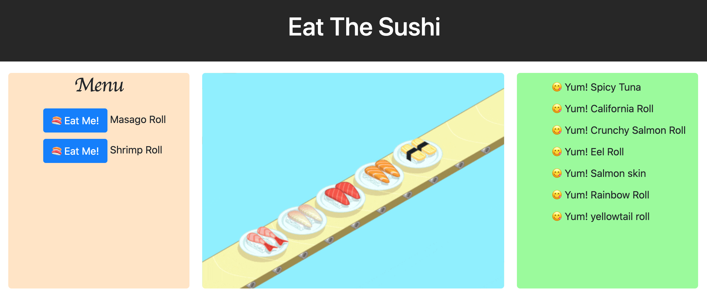

[](https://opensource.org/licenses/MIT)
  # Eat The Sushi

  

  ## Table of Contents
  * [Description](#description)
  * [Installation](#installation)
  * [Usage](#usage)
  * [Contributing](#contributing)
  * [Tests](#tests)
  * [Questions](#questions)
  * [License](#license)

  ## Description
  I was tasked with building out a full stack application to be deployed on Heroku. The package employs a MVC file structure with a custom built ORM. The ORM contains the necessary methods to access a SQL database. In the deployed app JAWSDB is used by Heroku to store data in SQL. The database structure is as follows: 
```
sushi_db
└── sushi (table)
    ├── id (primary key)
    ├── sushi_name (string)
    └── eaten (boolean) 
```
  The front end of the application harnesses user input and relays it to the server side with jQuery ajax routes. The server side logic uses CRUD to route database information and html via express and express-handlebars. 
  ## Installation
  The necessary dependencies can be found in the package.json file. The three main dependencies are express, express-handlebars, and mysql. Once forked, ```npm i``` will install all dependencies.
  ## Usage
  The following is a link to the deployed site:
  
  [Eat the Sushi!](https://eat-the-sushi.herokuapp.com/)
  ## Contributing
  Special thanks to Heroku, Express, Handlebars, and MySQL
  ## Tests
  N/A
  ## Questions
  Github profile: [dgtlctzn](https://github.com/dgtlctzn)
  
  If you have any questions about the project please contact josephperry720@gmail.com
  ## License
  This project is covered under the MIT license
